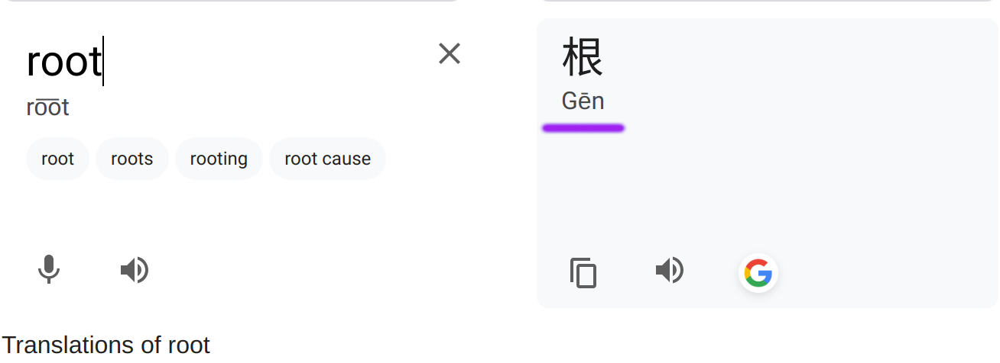
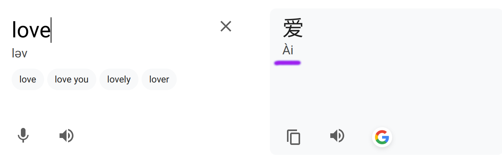

# airoot

GenAI 

 

 

### Suite of generation models for text, image, audio and video

Simple library and CLI like usage to easily run generation models locally. 
Mainly intended for trying out and swapping different models quickly, with cpu/gpu usage and basic command line interface for converting different input modalaties into others.

Popular LLMs usage, pdf_to_text, image_to_text, OCR support, image generation, inpainting, music and audio generation, transcription, video generation and video transcription. 

---

### Installation

```
pip install airoot
```
Next, install ParlerTTS (text to speech model):
```
pip install git+https://github.com/huggingface/parler-tts.git
```

**If NVIDIA CUDA GPU available, then additionally do**
```
pip install timm
pip install --no-build-isolation flash_attn
pip install bitsandbytes
```

Extra, Dev mode:

`pip install airoot[dev]` for dev dependencies

```bash
make develop # in repo root to install in editable mode with dev dependencies
pre-commit install # set up the pre-commit git hook to run isort and black automatically
pre-commit run --all-files # to manually run the pre-commit checks
```

---

### Audio Module 🔊 🗣️ 🎶

#### Text to Audio (Audio generation)

For generating audio (from text), see `audiogen` in [Audiogen Module](./src/airoot/audio/TextToAudio.md)

#### Audio to Text (Transcription/Translation)

For converting audio to text, i.e., transcription and translation, see `audiototext` in [Transcription Module](./src/airoot/audio/AudioToText.md)

---
### Notes 📝

- Do `get_models(<Module>)` (AudioToText, ImageToText etc.,)(see `src/airoot/etc/__init__.py` modules for full list) in python to see the config for default models to use for that module based on CPU vs GPU availablity. 

- The **first time** these commands are run, the script `test_load_model.py` is run with the different models available (in order), and sets the **first model that can be successfully loaded into memory** as the **default model** for that machine. Writes the default model to `~/.cache/airoot/<module>/...`. 
    - This can take long the first time, so please allow it some time.
    - For subsequent runs, by default uses the model in this file (if file exists) and doesn't try to re-check again. So, next runs should be slightly faster.
    - To force re-checking compatability/model loading again, debugging etc., simply remove the file `rm ~/.cache/airoot/<module>/.../model.keys`. 

---
### Troubleshooting ❗

If CUDA OOM error and reserved but unallocated memory by PyTorch is large try setting `export PYTORCH_CUDA_ALLOC_CONF=expandable_segments:True` to avoid fragmentation.

❗If issues detecting/using GPU, **ensure PyTorch and CUDA versions are compatible**! Otherwise torch might fail to detect the gpu. Ensure cuda is installed and setup. (Can try running a simple cuda script compiled with nvcc to see if GPU and drivers are working properly)

Get PyTorch and CUDA versions:
```bash
pip show torch
nvcc --version
nvidia-smi
```
```python
import torch
torch.version.cuda
torch.cuda.is_available()
torch.cuda.get_device_name(0)

torch._C._cuda_init() # Can try initializing manually to see any errors
```
⭐ **See [Compatabilty Matrix](https://github.com/pytorch/pytorch/blob/main/RELEASE.md#release-compatibility-matrix) here and fix accordingly.**


To Fix:

1. Either install compatible PyTorch build
```bash
pip uninstall torch torchvision torchaudio
pip install torch torchvision torchaudio --index-url https://download.pytorch.org/whl/cu121 # your CUDA version here
```

OR

2. Install compatible CUDA ToolKit (for supported CUDA version).

[Install CUDA](https://docs.nvidia.com/cuda/) for your OS and switch to that version. 
```bash
export PATH=/usr/local/cuda-12.1/bin:$PATH # Use the compatible cuda version here
export LD_LIBRARY_PATH=/usr/local/cuda-12.1/lib64:$LD_LIBRARY_PATH
```

