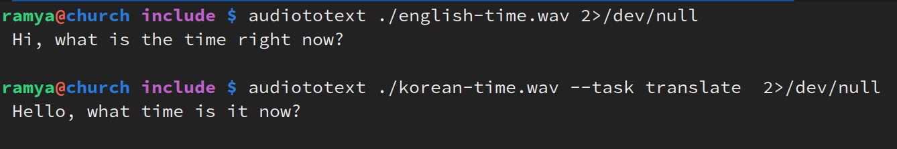
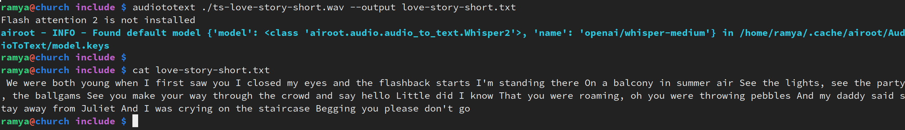

# Transcription/Translation (AudioToText) Module
Easily convert speech, dialogue, songs etc., to text!

## Usage
### Via CLI
```
audiototext <sample_audio.wav>
```
```
audiototext <sample_audio.wav> --task translate
```
Auto-detects source language and based on `--task` (transcribe/translate, defaults to 'transcribe') **transcribes** from source audio to text in the **detected language** *OR* **translates** to text in **English**.

```
audiototext <sample_audio.wav> --output sample.txt
```
- Optionally write output text to file. If not given, prints to stdout.

- Also supports piping in audio data and piping out the text to/from upstream/downstream processes.

⭐ Can use together with `audiogen` to generate sample audio and transcribe/translate it back. Use audiogen Bark model on GPU with different voice-presets for generating audio in other languages.
```
audiogen "Salut, Comment vas-tu ?" -vp v2/fr_speaker_0 | audiototext --task translate
```

### Examples
⏰ English and Korean clips asking the time:

<p>English</p>
<audio controls>
  <source src="../../../include/english-time.wav" type="audio/wav" alt="English">
  Your browser does not support the audio element.
</audio>

<p>Korean</p>
<audio controls>
  <source src="../../../include/korean-time.wav" type="audio/wav" alt="Korean">
  Your browser does not support the audio element.
</audio>





💛 Taylor Swift love story clip:

<audio controls>
  <source src="../../../include/ts-love-story-short.wav" type="audio/wav">
  Your browser does not support the audio element.
</audio>





### Via Library
In Python

```python
import librosa

from airoot.base_model import get_models
from airoot.audio import AudioToText, Whisper2

# See all available default models for cpu/gpu
available_models = get_models("AudioToText")

# Load the audio file (needs a sample rate of 16kHz for Whisper inference)
target_sr = 16000
audio, sr = librosa.load('korean-time.wav', sr=target_sr)

# Tries to load best model based on cpu/gpu availability
model = AudioToText()
# model = Whisper2(available_models["cpu"][0]) # use directly for testing etc.,

transcribed_text = model.generate(audio) # transcribes to Korean
translated_text = model.generate(audio, task="translate") # translates to English
```

---
## Models Used
[OpenAI Whisper models](https://huggingface.co/openai).

[Whisper Medium](https://huggingface.co/openai/whisper-medium) and [Whisper Small](https://huggingface.co/openai/whisper-small) for **CPU**.

[Whisper Large v2](https://huggingface.co/openai/whisper-large-v2) for **GPU**. If fails for any reason, defaults to CPU models.

---
## Notes 📝

- `.wav` files are recommended for best results.
    - Can use ffmpeg to convert to wav format. `ffmpeg -i <input.mp4> <converted.wav`

- The Whisper model is intrinsically designed to work on audio samples of ***up to 30s*** in duration.
    - The "automatic-speech-recognition" pipeline with chunking algorithm (chunk_length_s=30) allows processing much longer samples.
