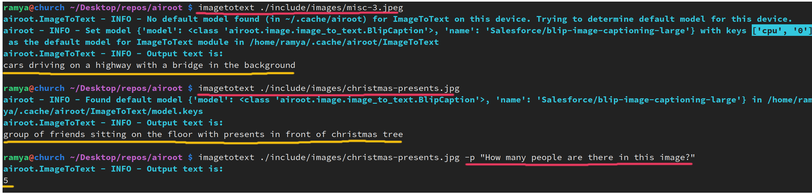
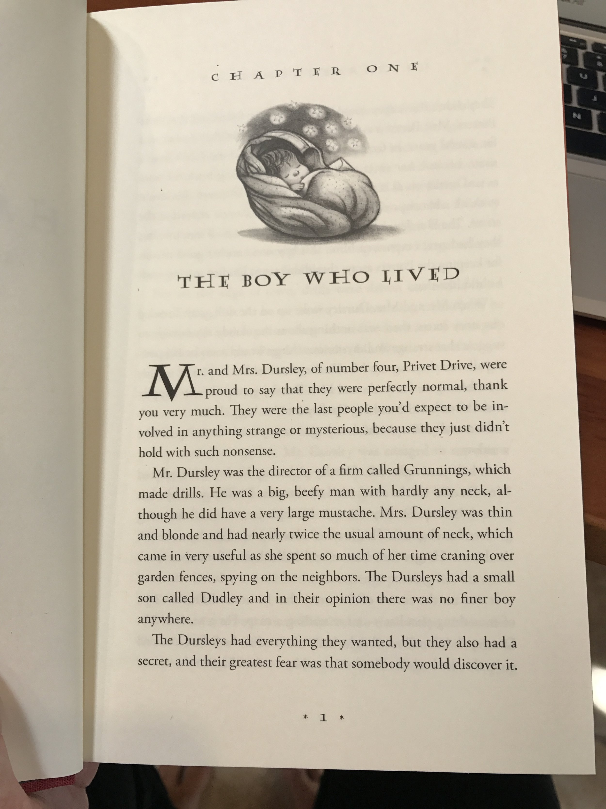

# Image Captioning / VQA (ImageToText) Module
Quickly generate detailed captions/descriptions for images and do visual question answering (VQA) tasks!

❗ GPU highly recommended for best outputs and faster inferences.

## Usage
### Via CLI
```
imagetotext <sample_image.png>
```
```
imagetotext <sample_image.png> --prompt <prompt/question> --max-length 512
```
Provide user `--prompt/-p` i.e., question for VQA tasks.
```
imagetotext <sample_image.png> --extract-text
```
To perform OCR and extract any text present in the image.

```
imagetotext <sample_image.png> -o out.txt
cat <sample_image.png> | imagetotext >> out.txt
```
- Optionally write output text to file. If not given, prints to stdout.

- Also supports piping in audio data and piping out the text to/from upstream/downstream processes.

⭐ Can use together with `imagegen` to generate sample images and describe/vqa it back.

#### Examples
*On CPU:*



 


*On GPU:*

 


### Via Library
In Python

```python
from PIL import Image
from airoot.base_model import get_models
from airoot.image import ImageToText, Llava, EasyOCR, Florence

# See all available default models for cpu/gpu
available_models = get_models("ImageToText")

# Tries to load best model based on cpu/gpu availability
model = ImageToText()
# OR can use directly too
model = Llava()

# load image
img_path = "<full-path-to-image-file>"
image = Image.open(img_path).convert("RGB")

# Describe image
description = model.generate(image)
# Visual QA on GPU
answer = model.generate(image, text="How many people are there in this image?")

# Text extraction via OCR Model
ocr = EasyOCR()
extracted_text = ocr.generate(img_path)

# Using Florence for various other tasks like Object Detection <OD>, <CAPTION_TO_PHRASE_GROUNDING> etc.,
florence = Florence()
bboxes = florence.generate(image, task_prompt="<OD>")
flower_bbox_outputs = florence.generate(image, task_prompt="<CAPTION_TO_PHRASE_GROUNDING>", text="flower")
```

## Models Used

| Model Family   |   Docs / Links          |
|----------------|-----------------------|
| Salesforce BLIP      | [BLIP Image Captioning](https://huggingface.co/docs/transformers/en/model_doc/blip#transformers.BlipForConditionalGeneration) &#124; [BLIP VQA](https://huggingface.co/docs/transformers/en/model_doc/blip#transformers.BlipForQuestionAnswering)          |
| LLaVa      | [LLaVa](https://huggingface.co/docs/transformers/main/en/model_doc/llava#single-image-inference) &#124; [LLaVa-NeXT](https://huggingface.co/docs/transformers/main/en/model_doc/llava_next#single-image-inference)          |
| Microsoft Florence      | [Florence](https://huggingface.co/microsoft/Florence-2-large-ft)           |
| EasyOCR      | [EasyOCR GitHub](https://github.com/JaidedAI/EasyOCR)            |

- Florence model has many other tasks like object detection, phrase grounding, ocr etc.,!

## Notes 📝

- `"Salesforce/blip-image-captioning-large"` (CPU model) doesn't do well at all with the extra user prompt (just outputs the prompt back and not description or answers). So on CPU, Blip VQA model is used instead, if prompt/question is provided. Blip VQA is good with single word and boolean answers and simple counting tasks.

- Microsoft Florence model only uses/takes additional user prompt (text) if the task is `"<CAPTION_TO_PHRASE_GROUNDING>"`. See Model link for full list of available tasks and output formats.

- GPU highly recommended for best outputs, detailed decsriptions and other tasks with user prompts.
